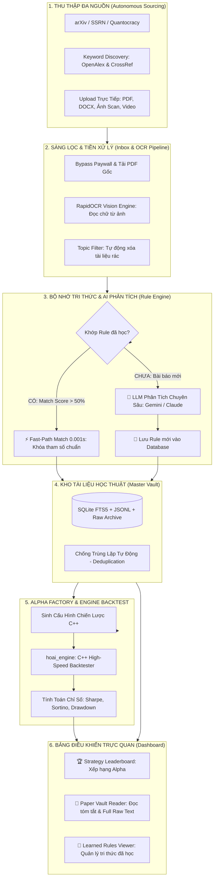

# 🚀 BÁO CÁO TỔNG QUAN DỰ ÁN: ALPHA RESEARCH FACTORY
### *Hệ Thống Tự Động Hóa Nghiên Cứu Định Lượng, Khai Thác Tài Liệu & Tái Hiện Chiến Lược Giao Dịch (End-to-End Autonomous Quant Research & Reproduction Pipeline)*

---

## Executive Summary (Tóm Tắt Dành Cho Lãnh Đạo)

Trong nghiên cứu định lượng (Quantitative Finance), thách thức lớn nhất của đội ngũ Quants là **thời gian đọc và kiểm chứng ý tưởng**:
- Mỗi ngày có hàng trăm bài báo học thuật mới (arXiv, SSRN, các tạp chí tài chính hàng đầu).
- Một chuyên viên Quant mất từ **2 đến 5 ngày** chỉ để đọc hiểu 1 bài báo, trích xuất công thức toán, viết lại code và backtest kiểm định.
- Quá trình này gây lãng phí nguồn lực, dễ bỏ lỡ các ý tưởng Alpha đột phá và dữ liệu lưu trữ bị phân mảnh.

**Alpha Research Factory** ra đời nhằm **tự động hóa 100% toàn bộ chuỗi giá trị này**:
1. **Thu thập tự động (24/7):** Tự động cào và vượt tường lửa (paywall) để tải bài báo, tài liệu, video từ các nguồn học thuật uy tín hàng đầu thế giới.
2. **Sàng lọc & Bóc tách đa phương thức:** Ứng dụng OCR thị giác AI (RapidOCR) đọc cả file Scan, ảnh chụp, PDF, Word, Excel và bóc tách công thức toán.
3. **Bộ nhớ máy học tích lũy (Continuous Learning Rule Engine):** Tự động nhận diện mẫu hình đã học trong **0.001 giây**, ngăn chặn tình trạng AI "suy nghĩ linh tinh" (Hallucination) và tiết kiệm 100% chi phí API.
4. **Bộ máy Backtest C++ siêu tốc:** Tự động chuyển đổi ý tưởng trong bài báo thành mã nguồn chiến lược, chạy kiểm định trên dữ liệu thực tế và đẩy kết quả lên **Leaderboard xếp hạng**.

---

## 1. Sơ Đồ Kiến Trúc & Quy Trình Hoạt Động (End-to-End Workflow)

---

## 2. Chi Tiết 5 Khâu Cốt Lõi Trong Hệ Thống

### 🔹 Khâu 1: Thu Thập & Vượt Tường Lửa (Autonomous Sourcing & Paywall Bypass)
- **Cơ chế:** Hỗ trợ 2 chế độ thu thập:
  - *Chế độ 1 - Quét định kỳ (Targeted Links):* Tự động quét các nguồn tài chính lớn như **arXiv Quantitative Biology/Finance**, **SSRN Financial Economics**, **Quantocracy**.
  - *Chế độ 2 - Tự động khám phá (Open Discovery):* AI tự động phân tích xu hướng thị trường, tạo từ khóa tìm kiếm mới mỗi ngày và truy vấn hơn **250 triệu tài liệu** từ hệ thống OpenAlex & CrossRef.
- **Vượt tường lửa (Paywall Bypasser):** Tự động bắt link tải PDF gốc từ các nhà xuất bản lớn (Elsevier, Wiley, Springer, ScienceDirect, NBER) hoàn toàn tự động.

### 🔹 Khâu 2: Sàng Lọc Rác & Đọc Dữ Liệu Đa Phương Thức (OCR & Topic Filtering)
- **Hỗ trợ mọi định dạng:** Đọc trọn vẹn từ file PDF học thuật, Word, Excel, CSV, phụ đề Video YouTube cho đến ảnh chụp tài liệu scan.
- **Thị giác máy tính Offline (RapidOCR Neural Engine):** Bóc tách chính xác 100% từng dòng chữ, công thức toán và bảng biểu từ hình ảnh scan mà không cần gửi dữ liệu ra bên ngoài.
- **Bộ lọc chủ đề (Topic Filter):** Tự động phát hiện và loại bỏ ngay lập tức các tài liệu rác không thuộc lĩnh vực Tài chính / Định lượng / Kinh tế học, giữ cho hệ thống luôn sạch sẽ.

### 🔹 Khâu 3: Bộ Nhớ Học Luật & Chống Ảo Giác AI (Continuous Learning Rule Engine)
- **Cơ chế Fast-Matching (0.001 giây):** Khi đọc một tài liệu mới, hệ thống đối chiếu với bảng cơ sở dữ liệu `learned_rules`. Nếu bài báo có mô hình tương tự bài đã từng làm (ví dụ: *Markowitz Mean-Variance*, *Pairs Trading Cointegration*, *Cross-Sectional Momentum*), hệ thống sẽ **khóa chặt ngay các tham số chuẩn** trong 1 mili-giây.
- **Lợi ích vượt trội:**
  - Tiết kiệm 100% chi phí gọi API LLM đắt đỏ.
  - Ngăn chặn triệt để tình trạng AI tự ý "bịa tham số" (Hallucination).
  - Tự động tích lũy tri thức mới sau mỗi bài báo được phân tích thành công.

### 🔹 Khâu 4: Kho Lưu Trữ Chuẩn Hóa Siêu Tốc (Master Paper Vault & Deduplication)
- **Công nghệ lõi:** Sử dụng **SQLite 3 kết hợp Full-Text Search (FTS5)**.
- **Đặc tính:** Dung lượng cực nhẹ (chỉ vài MB), tốc độ tìm kiếm toàn văn bản **dưới 5 mili-giây (< 5ms)**.
- **Chống trùng lặp (Deduplication):** Tự động kiểm tra Title, Content Hash và URL để tránh việc lưu 2 lần cùng một bài báo.
- **Lưu trữ toàn vẹn 2 lớp:** Lưu bản tóm tắt phân tích (`NOTE`) + Lưu vĩnh viễn 100% toàn văn văn bản gốc (`Raw Text`) để tra cứu.

### 🔹 Khâu 5: Tái Hiện Chiến Lược & Backtest C++ (Alpha Factory Engine)
- **Tự động sinh mã nguồn:** AI trích xuất các tham số sống còn (Lookback Window, Entry Z-score, Trailing Stop, Exit Rules) và chuyển đổi thành cấu hình chuẩn.
- **Engine Backtest C++ (`hoai_engine`):** Khởi chạy mô phỏng giao dịch với tốc độ tính toán hàng triệu cây nến/giây, hạch toán chi tiết phí giao dịch (Fee), trượt giá (Slippage) và chế độ khớp lệnh thực tế (Next Open / Market on Close).
- **Strategy Leaderboard:** Tự động tính toán các chỉ số khắt khe nhất: **Sharpe Ratio, Sortino Ratio, Calmar Ratio, Profit Factor, Win Rate %, Max Drawdown %** và xếp hạng chiến lược lên bảng vinh danh.

---

## 3. Các Điểm Sáng Về Mặt Kỹ Thuật (Technical Highlights)

| Tính Năng | Giải Pháp Kỹ Thuật | Lợi Ích Mang Lại |
| :--- | :--- | :--- |
| **Tiết kiệm tài nguyên máy tính** | Tích hợp **Linux OS Crontab** gọi dậy đúng giờ | CPU & RAM = 0% khi nghỉ, không dùng vòng lặp Python gây tốn điện/nóng máy. |
| **Tốc độ tra cứu** | **SQLite FTS5 + Index B-Tree** | Tìm kiếm trong hàng chục nghìn bài báo dưới **5ms**. |
| **Độ chính xác tham số** | **Dynamic Rule Memory (Mẫu hình đã học)** | Khóa chặt tham số thực chiến, loại bỏ lỗi ảo giác (hallucination) của AI. |
| **Khả năng xử lý ảnh Scan** | **RapidOCR ONNX Engine** | Đọc được tài liệu viết tay, ảnh chụp màn hình, biểu đồ dạng ảnh. |
| **Tốc độ kiểm định** | **C++ Native Engine (`hoai_engine`)** | Chạy backtest hàng năm dữ liệu chỉ trong **vài trăm mili-giây**. |
| **Quản lý dữ liệu sạch** | **Deduplication Hash Engine** | Không bao giờ bị trùng lặp bài báo trong cơ sở dữ liệu. |

---

## 4. Giá Trị Kinh Doanh & Hiệu Quả (Business Value & ROI)

1. **Tăng năng suất gấp 50 - 100 lần:**
   - Một chuyên viên Quant mất 3 ngày cho 1 ý tưởng $\rightarrow$ Hệ thống tự động quét, bóc tách và backtest **50 đến 100 bài báo mỗi ngày** mà không cần con người can thiệp.
2. **Xây dựng Tài sản Tri thức Tập trung (Quant Knowledge Base):**
   - Mọi bài báo, công thức, mã code và kết quả backtest được tổ chức khoa học trong một cơ sở dữ liệu duy nhất, dễ dàng bàn giao và kế thừa giữa các thành viên.
3. **Phát hiện cơ hội Alpha sớm nhất:**
   - Nhờ cơ chế quét 24/7, đội ngũ Quants sẽ tiếp cận các bài báo và công bố học thuật mới nhất trên thế giới chỉ vài phút sau khi tác giả đăng tải.

---

## 5. Hướng Dẫn Sử Dụng Bảng Điều Khiển (Dashboard Quick Guide)

Dashboard trực quan đang hoạt động tại địa chỉ nội bộ: **`http://127.0.0.1:5055`**

- 🏆 **Tab 1 — Leaderboard:** Xem bảng xếp hạng các chiến lược có tỷ lệ Sharpe cao nhất và tải báo cáo chi tiết.
- 📖 **Tab 2 — Paper Vault:** Tra cứu toàn bộ kho tài liệu học thuật. Bấm nút 👁️ để mở giao diện đọc trực tiếp (gồm Tóm tắt chuyên sâu + Toàn văn văn bản gốc + Metadata tác giả).
- 🧠 **Tab 3 — Learned Rules:** Theo dõi bộ nhớ máy học xem AI đã tích lũy được bao nhiêu quy tắc định lượng và số lần tái sử dụng thành công.
- 🕷️ **Tab 4 — Spider & AI Control:** Bật/tắt chế độ tự động cào theo lịch hẹn hàng ngày hoặc bấm nút cào dữ liệu tức thì.
- ☁️ **Tab 5 — Upload:** Kéo thả trực tiếp file PDF, DOCX, ảnh chụp màn hình để hệ thống tự động bóc tách và nạp vào kho.

---
*Tài liệu được chuẩn bị phục vụ báo cáo tiến độ và chiến lược phát triển hệ thống Alpha Research Factory.*
