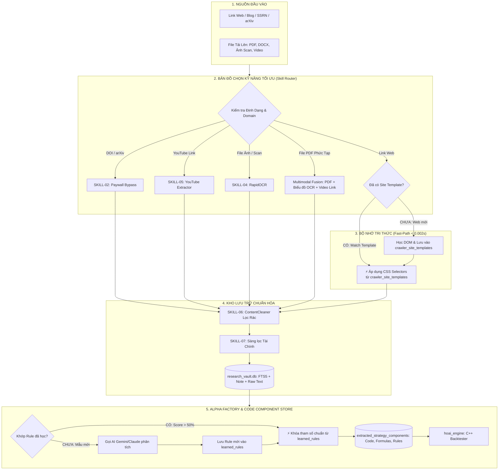

# 📘 TÀI LIỆU KỸ THUẬT KIẾN TRÚC HỆ THỐNG & BỘ KỸ NĂNG TỰ HỌC
## ALPHA RESEARCH FACTORY (AUTONOMOUS QUANT RESEARCH PIPELINE)

---

## 1. Tổng Quan & Triết Lý Vận Hành Cốt Lõi

**Alpha Research Factory** là hệ thống tự động hóa toàn diện quy trình nghiên cứu định lượng: từ thu thập tài liệu học thuật (arXiv, SSRN, Journals), giải mã bài báo bị khóa Paywall, đọc ảnh scan và video, trích xuất mã nguồn/công thức toán, cho đến việc nạp vào Engine C++ để chạy Backtest kiểm định chiến lược.

### 🌟 Triết Lý Thiết Kế: *"Gặp khó 1 lần — Biến thành Kỹ năng mãi mãi"*
1. **Zero Re-learning (Không học lại từ đầu):** Tất cả 7 kỹ năng bóc tách lõi (PDF, OCR, Paywall, Video, De-Noiser...) được đúc cố định thành các Module Python và Mạng Nơ-ron chạy Offline.
2. **Fast-Path Pattern Matching (Khớp mẫu trong 0.001 giây):** Khi gặp lại một trang web hoặc một mô hình bài báo tương tự, hệ thống kích hoạt ngay công thức đã lưu trong SQLite, bỏ qua 100% việc gọi LLM để tiết kiệm chi phí và triệt tiêu lỗi ảo giác (Hallucination).
3. **Continuous Recipe Learning (Tự động tích lũy kinh nghiệm):** Mỗi khi xử lý thành công một bài báo phức tạp (chứa ảnh đồ thị hoặc link video), hệ thống tự động đóng gói toàn bộ quy trình thành một **Recipe chuyên biệt** để tái sử dụng vĩnh viễn.

---

## 2. Bảng Tra Cứu 7 Kỹ Năng Hệ Thống (Table of System Skills)

| Mã Kỹ Năng | Tên Kỹ Năng | Vai Trò & Chức Năng | File Mã Nguồn | Công Nghệ / Thư Viện Lõi |
| :--- | :--- | :--- | :--- | :--- |
| **SKILL-01** | **Anti-Bot & Network Stealth** | Giả lập trình duyệt, xoay vòng User-Agent Chrome 120+, vượt Cloudflare & mã lỗi 403. | [`bypass/anti_scraping_bypass.py`](file:///home/hoai/Alphareserach_agent-codex-alpha-repro-lite-core/alpha-repro-lite/bypass/anti_scraping_bypass.py) | `requests.Session`, Stealth Headers, Jina Reader Fallback |
| **SKILL-02** | **Academic Paywall Bypassing** | Trích xuất DOI/arXiv ID, truy vấn Unpaywall, OpenAlex, Semantic Scholar và Sci-Hub mirrors. | [`bypass/academic_paywall_bypass.py`](file:///home/hoai/Alphareserach_agent-codex-alpha-repro-lite-core/alpha-repro-lite/bypass/academic_paywall_bypass.py) | Unpaywall API, CrossRef, Sci-Hub Proxy Rotation |
| **SKILL-03** | **Deep PDF & File Extractor** | Đọc PDF 2 cột, giải mã file khóa, bóc tách Office (Word, Excel, CSV, JSON, Markdown). | [`extractors/pdf_extractor.py`](file:///home/hoai/Alphareserach_agent-codex-alpha-repro-lite-core/alpha-repro-lite/extractors/pdf_extractor.py), [`extractors/content_cleaner.py`](file:///home/hoai/Alphareserach_agent-codex-alpha-repro-lite-core/alpha-repro-lite/extractors/content_cleaner.py) | `pypdf`, `python-docx`, `openpyxl`, `pandas` |
| **SKILL-04** | **Visual Neural OCR Engine** | Thị giác máy tính đọc chữ, số liệu đồ thị, bảng biểu từ file ảnh scan, ảnh chụp màn hình. | [`extractors/media_extractor.py`](file:///home/hoai/Alphareserach_agent-codex-alpha-repro-lite-core/alpha-repro-lite/extractors/media_extractor.py) | `rapidocr_onnxruntime` (Offline Neural Network), PIL |
| **SKILL-05** | **Media Video Transcript** | Bóc tách toàn bộ phụ đề, lời thoại video từ link YouTube hoặc file video đính kèm. | [`extractors/video_extractor.py`](file:///home/hoai/Alphareserach_agent-codex-alpha-repro-lite-core/alpha-repro-lite/extractors/video_extractor.py) | `youtube_transcript_api`, `yt-dlp` |
| **SKILL-06** | **Smart De-Noiser & HTML Cleaner**| Loại bỏ 100% quảng cáo, menu điều hướng, cookie banners, tracking scripts để lấy văn bản sạch. | [`extractors/content_cleaner.py`](file:///home/hoai/Alphareserach_agent-codex-alpha-repro-lite-core/alpha-repro-lite/extractors/content_cleaner.py) | `trafilatura`, `BeautifulSoup4`, `lxml`, Regex Heuristics |
| **SKILL-07** | **Semantic Topic & Quality Filter**| Sàng lọc nội dung, phát hiện và xóa tự động các tài liệu rác không thuộc Tài chính / Định lượng. | [`vault/text_analyzer.py`](file:///home/hoai/Alphareserach_agent-codex-alpha-repro-lite-core/alpha-repro-lite/vault/text_analyzer.py) | Finance Keyword Taxonomy, Regex Matcher, LLM Classifier |

---

### 🔹 2.1. Vị Trí Lưu Trữ & Chi Tiết Các Đoạn Code Thực Thi (Implementation Code Locations)

Dưới đây là vị trí chính xác của từng đoạn code điều phối bản đồ kỹ năng và bóc tách web:

#### 1. Đoạn Code "Bản Đồ Chọn Kỹ Năng Tối Ưu" (Optimal Skill Router)
- **Vị trí file:** [`research_coordinator.py`](file:///home/hoai/Alphareserach_agent-codex-alpha-repro-lite-core/alpha-repro-lite/research_coordinator.py) (Hàm `process_url()` - Dòng 49 đến 88)
- **Nội dung code thực thi:**
  ```python
  # research_coordinator.py
  def process_url(self, url: str, custom_note: str = "") -> Dict[str, Any]:
      # 1. Phát hiện link YouTube -> Chuyển sang VideoExtractor (SKILL-05)
      if "youtube.com" in url or "youtu.be" in url:
          extracted = VideoExtractor.extract_from_youtube(url)
          source_type = "VIDEO"
      
      # 2. Phát hiện DOI / arXiv -> Chuyển sang Paywall Bypass (SKILL-02)
      elif self.paywall_bypass.extract_doi(url) or self.paywall_bypass.extract_arxiv_id(url):
          pdf_bytes, bypass_method, bypass_meta = self.paywall_bypass.resolve_paywalled_paper(url)
          if pdf_bytes:
              extracted = PDFExtractor.extract_from_bytes(pdf_bytes, filename=f"paper_{bypass_meta.get('doi', 'arxiv')}.pdf")
              source_type = "PAPER"
          else:
              extracted = self.web_extractor.extract_from_url(url)
              source_type = "PAPER"

      # 3. Mặc định là Web / Blog -> Chuyển sang WebExtractor có gắn SiteTemplateEngine (SKILL-06)
      else:
          extracted = self.web_extractor.extract_from_url(url)
          source_type = "BLOG" if ("medium.com" in url or "substack.com" in url) else "WEB_PAGE"

      return self._finalize_ingestion(...)
  ```

#### 2. Đoạn Code "Vượt Tường Lửa Học Thuật" (Academic Paywall Escalation Chain)
- **Vị trí file:** [`bypass/academic_paywall_bypass.py`](file:///home/hoai/Alphareserach_agent-codex-alpha-repro-lite-core/alpha-repro-lite/bypass/academic_paywall_bypass.py) (Hàm `resolve_paywalled_paper()` - Dòng 130 đến 180)
- **Nội dung code thực thi:**
  ```python
  # bypass/academic_paywall_bypass.py
  def resolve_paywalled_paper(self, url_or_text: str):
      doi = self.extract_doi(url_or_text)
      # Bậc 1: Truy vấn Unpaywall API lấy PDF Open Access chính thức từ các trường ĐH
      pdf_bytes, method, meta = self.fetch_via_unpaywall(doi)
      if pdf_bytes: return pdf_bytes, method, meta

      # Bậc 2: Truy vấn OpenAlex / Semantic Scholar lấy bản preprint miễn phí
      pdf_bytes, method, meta = self.fetch_via_openalex(doi)
      if pdf_bytes: return pdf_bytes, method, meta

      # Bậc 3: Tự động xoay vòng Sci-Hub Mirror Proxy (.se, .st, .ru) để tải PDF
      pdf_bytes, method, meta = self.fetch_via_scihub_mirrors(doi)
      if pdf_bytes: return pdf_bytes, method, meta
      return None, "Paywall Bypass Failed", {}
  ```

#### 3. Đoạn Code "Bóc Tách Web Siêu Tốc Theo Mẫu" (Site Template Fast-Path Engine)
- **Vị trí file:** [`vault/site_template_engine.py`](file:///home/hoai/Alphareserach_agent-codex-alpha-repro-lite-core/alpha-repro-lite/vault/site_template_engine.py) (Hàm `match_template()` & `extract_with_template()`)
- **Tích hợp tại:** [`extractors/web_extractor.py`](file:///home/hoai/Alphareserach_agent-codex-alpha-repro-lite-core/alpha-repro-lite/extractors/web_extractor.py) (Dòng 68 đến 95)
- **Nội dung code thực thi:**
  ```python
  # extractors/web_extractor.py
  # Tra cứu template CSS Selectors từ SQLite trong 0.001s
  tpl_engine = SiteTemplateEngine()
  matched_tpl = tpl_engine.match_template(url)
  if matched_tpl:
      # Bóc tách Title, Body, Author trực tiếp qua CSS Selectors mà không cần gọi LLM
      tpl_res = tpl_engine.extract_with_template(html_or_md, matched_tpl)
      clean_tpl_text = ContentCleaner.clean_article_text(tpl_res["text"])
      return {
          "title": tpl_res["title"],
          "text": clean_tpl_text,
          "extraction_method": f"Site Template Engine [{matched_tpl['id']}]"
      }
  ```

#### 4. Đoạn Code "Hợp Nhất Đa Phương Thức" (PDF + Biểu Đồ RapidOCR + Video Transcript)
- **Vị trí file:** [`extractors/pdf_extractor.py`](file:///home/hoai/Alphareserach_agent-codex-alpha-repro-lite-core/alpha-repro-lite/extractors/pdf_extractor.py) (Dòng 60 đến 115)
- **Nội dung code thực thi:**
  ```python
  # extractors/pdf_extractor.py
  for page in reader.pages:
      page_text = page.extract_text()
      # Quét và bóc tách ảnh biểu đồ nhúng -> Đưa qua RapidOCR đọc số liệu
      if hasattr(page, "images") and page.images:
          for img_name, img_bytes in page.images.items():
              ocr_res = MediaExtractor.extract_from_image(img_bytes)
              img_ocr_texts.append(f"[BIỂU ĐỒ '{img_name}' OCR]: {ocr_res['text']}")
      # Quét link YouTube nhúng trong PDF -> Cào phụ đề video
      yt_matches = re.findall(r'(https?://(?:www\.)?youtube\.com/watch\?v=[\w-]+)', page_text)
      # Hợp nhất Chữ + OCR Biểu Đồ + Phụ Đề Video thành 1 văn bản toàn diện
  ```

---

## 3. Sơ Đồ Quy Trình Tự Học & Bóc Tách (System Diagrams)



---

## 4. Cơ Cấu Lưu Trữ Cơ Sở Dữ Liệu (Database Schemas)

Hệ thống quản lý dữ liệu trên 2 cơ sở dữ liệu SQLite siêu nhẹ và độc lập:

### 🗄️ Database 1: `quant_platform.db` (Quản lý Chiến Lược, Bộ Nhớ Tri Thức & Templates)

#### 1. Bảng `crawler_site_templates` (Lưu công thức bóc tách Web)
- `id` (TEXT PRIMARY KEY): Mã template (`TPL-SUBSTACK-001`, `TPL-MEDIUM-001`, `TPL-SSRN-001`).
- `domain_pattern` (TEXT): Tên miền nhận diện (`substack.com`, `arxiv.org`, `medium.com`).
- `cms_type` (TEXT): Nền tảng (`Substack`, `WordPress`, `Medium`).
- `title_selector`, `content_selector`, `author_selector`, `date_selector` (TEXT): CSS Selectors.
- `noise_selectors` (TEXT JSON): Danh sách class rác cần loại bỏ (`[".ad-box", ".comments"]`).
- `hit_count` (INTEGER): Đếm số lần tái sử dụng thành công (tăng theo thời gian).

#### 2. Bảng `extracted_strategy_components` (Kho Phụ Tùng Chiến Lược: Code, Toán, Tham Số)
- `id` (TEXT PRIMARY KEY): Mã thành phần (`COMP-20260817-0001`).
- `vault_id` (TEXT): Khóa ngoại trỏ về bài báo gốc (`RES-20260814-0033`).
- `strategy_name`, `model_family`, `asset_class`, `timeframe` (TEXT).
- `code_snippets` (TEXT JSON): Mã nguồn chuẩn (`{"lang": "python", "python": "def signal(...)", "cpp": "..."}`).
- `math_formulas` (TEXT JSON): Công thức toán học LaTeX (`{"spread": "Spread = Log(P_A) - beta*Log(P_B)"}`).
- `trading_rules` (TEXT JSON): Logic vào lệnh (`{"long_entry": "Z <= -1.5", "exit": "Z crosses 0"}`).
- `parameters` (TEXT JSON): Hyperparameters (`{"rolling_window": 21, "threshold_val": 1.5}`).
- `reported_metrics` (TEXT JSON): Chỉ số bài báo (`{"reported_sharpe": 2.77}`).
- `backtest_status` (TEXT): Trạng thái kiểm định (`PENDING`, `VERIFIED`).

#### 3. Bảng `learned_rules` (Bộ Nhớ Tri Thức Máy Học)
- `id` (TEXT PRIMARY KEY): Mã luật (`RULE-0001`).
- `name` (TEXT): Tên mẫu hình chiến lược / Recipe xử lý.
- `trigger_keywords` (TEXT JSON): Tập từ khóa kích hoạt Fast-Path.
- `rule_payload` (TEXT JSON): Cấu hình tham số đã được khóa chặt.
- `confidence` (REAL): Độ tin cậy ($0.90 - 0.98$).
- `hit_count` (INTEGER): Số lần đã khớp tự động.

---

### 🗄️ Database 2: `storage/structured_vault/research_vault.db` (Kho Tài Liệu Học Thuật)

- `research_vault`: Lưu trữ toàn văn bản thô (`raw_file_path`), bản tóm tắt phân tích (`note`), metadata tác giả, URL gốc.
- `research_vault_fts`: Bảng ảo tìm kiếm toàn văn bản **Full-Text Search (FTS5)** với tốc độ tra cứu $< 5\text{ms}$.

---

## 5. Cấu Trúc Lưu Trữ Mã Nguồn Chiến Lược (Strategy Code Storage Architecture)

Hệ thống quản lý và lưu trữ mã nguồn chiến lược theo **2 cấp độ (Database Level & File System Level)** cực kỳ chặt chẽ:

### 🔹 5.1. Lưu Trữ Trong Cơ Sở Dữ Liệu (`extracted_strategy_components`)

Mỗi chiến lược bóc tách từ bài báo được cấu trúc hóa thành một khối dữ liệu JSON đa ngôn ngữ nằm trong cột `code_snippets` và `parameters`:

```json
{
  "id": "COMP-20260817-0001",
  "vault_id": "RES-20260814-0033",
  "strategy_name": "Attention LSTM Markowitz Pairs Trading",
  "model_family": "Statistical_Arbitrage",
  "asset_class": "crypto",
  "timeframe": "1d",
  "code_snippets": {
    "lang": "python",
    "python": "def generate_signal(spread, zscore):\n    # Logic vào lệnh định lượng\n    if zscore < -1.5:\n        return 1   # Long Pair Spread\n    elif zscore > 1.5:\n        return -1  # Short Pair Spread\n    return 0",
    "cpp": "int calculate_signal(double zscore) {\n    if (zscore < -1.5) return 1;\n    if (zscore > 1.5) return -1;\n    return 0;\n}",
    "go": "func CalculateSignal(zscore float64) int {\n    if zscore < -1.5 { return 1 }\n    if zscore > 1.5 { return -1 }\n    return 0\n}"
  },
  "math_formulas": {
    "cointegration": "Spread_t = Log(P_A) - beta * Log(P_B)",
    "zscore": "Z_t = (Spread_t - mu_rolling) / sigma_rolling",
    "markowitz_optimization": "max w^T mu - lambda * w^T Sigma w"
  },
  "trading_rules": {
    "entry_long": "Z-score <= -1.5",
    "entry_short": "Z-score >= 1.5",
    "exit_rule": "Z-score crosses 0 OR holding_days >= 14",
    "risk_management": "Trailing Stop = 1.5x ATR, Max Holding = 14 bars"
  },
  "parameters": {
    "symbol": "BTCUSDT",
    "pair_symbol": "ETHUSDT",
    "rolling_window": 21,
    "threshold_val": 1.5,
    "is_reversion": true,
    "fee_rate": 0.0008,
    "slippage_rate": 0.0002
  },
  "backtest_status": "VERIFIED"
}
```

---

### 🔹 5.2. Lưu Trữ Tệp Tin Trên Ổ Cứng (File System Storage Hierarchy)

Ngoài Database, hệ thống duy trì cấu trúc file vật lý trên ổ đĩa để phục vụ Backtest và tra cứu trực tiếp:

```text
alpha-repro-lite/
├── storage/
│   ├── raw_sources/                      # 📂 KHO TÀI LIỆU TOÀN VĂN GỐC (Raw Archives)
│   │   ├── RES-20260814-0033_lstm_pairs.txt  # Toàn văn bài báo gốc 100%
│   │   └── SSRN-3325656_momentum.txt         # Toàn văn bài báo SSRN
│   └── structured_vault/
│       ├── research_vault.db             # 🗄️ SQLite Master Vault (FTS5 Search)
│       └── unified_vault.jsonl           # File JSONL backup đồng bộ
├── configs/                              # 📂 CẤU HÌNH CHIẾN LƯỢC CHO BACKTEST C++
│   ├── RES-20260814-0033_config.json    # JSON config nạp thẳng vào hoai_engine
│   └── SSRN-3325656_config.json
├── quant_platform.db                     # 🗄️ DATABASE TỔNG HỢP (Rules, Components, Leaderboard)
└── generated_alphas/                     # 📂 MÃ NGUỒN ALPHA XUẤT BẢN THỰC CHIẾN
    ├── 01_Dual_EMA_ADX_Trend/            # Thư mục chiến lược xuất bản sang Golang / Python Bot
    │   ├── alpha.go                      # Code thuật toán Go
    │   ├── config.json                   # Tham số cấu hình
    │   └── README.md                     # Tài liệu toán học của chiến lược
    └── 02_BB_RSI_Mean_Reversion/
```

---

## 6. Cấu Trúc Mã Nguồn Thư Mục Hệ Thống (System Directory Structure)

```text
alpha-repro-lite/
├── bypass/                           # Bộ công cụ Vượt rào cản & Bảo mật
│   ├── academic_paywall_bypass.py    # Vượt Paywall (Unpaywall, Semantic Scholar, Sci-Hub)
│   ├── anti_scraping_bypass.py       # Vượt Cloudflare, giả lập Stealth Headers
│   ├── file_decryptor.py             # Giải mã PDF khóa quyền copy, phục hồi stream hỏng
│   └── media_enhancer.py             # Tăng cường độ nét ảnh trước khi OCR
├── extractors/                       # Bộ công cụ Bóc tách Dữ liệu Đa Phương Thức
│   ├── content_cleaner.py            # Lọc rác HTML, banner, cookie, noise heuristics
│   ├── pdf_extractor.py              # Đọc PDF 2 cột, bóc tách biểu đồ nhúng, quét link video
│   ├── media_extractor.py            # Mạng nơ-ron RapidOCR đọc chữ từ ảnh scan (Offline)
│   ├── video_extractor.py            # Trích xuất phụ đề YouTube & Video local
│   ├── web_extractor.py              # Bóc tách web kết hợp SiteTemplateEngine
│   └── keyword_search_engine.py      # Tìm kiếm OpenAlex, CrossRef, arXiv
├── vault/                            # Bộ Não Tri Thức & Cơ Sở Dữ Liệu
│   ├── site_template_engine.py       # Quản lý & học mẫu CSS Selectors (crawler_site_templates)
│   ├── strategy_components_db.py     # Quản lý kho Code & Công thức (extracted_strategy_components)
│   ├── learned_rule_engine.py        # Quản lý bộ nhớ luật định lượng (learned_rules)
│   ├── unified_vault_db.py           # Quản lý kho bài báo SQLite FTS5 (research_vault.db)
│   └── text_analyzer.py              # Sàng lọc chủ đề tài chính & phân loại nội dung
├── scripts/                          # Dây chuyền Tự động hóa & Kiểm định
│   ├── auto_alpha_factory.py         # Trích xuất tham số & chạy Backtest C++
│   ├── process_inbox.py              # Xử lý tự động file tải lên trong inbox/
│   └── run_spider.py                 # Thu thập tự động theo lịch hẹn 24/7
├── sources/                          # Cấu hình nguồn cào dữ liệu
│   └── web_registry.yaml             # Danh bạ các trang web học thuật cố định
├── web/                              # Giao diện Bảng điều khiển (Dashboard 5055)
│   ├── app.py                        # Flask Backend REST API
│   ├── templates/index.html          # HTML5 Glassmorphism UI
│   └── static/                       # CSS styles & Client JS controllers
├── quant_platform.db                 # Database tổng hợp (Rules, Templates, Components, Backtests)
├── run_dashboard.py                  # Entrypoint khởi động Web Dashboard trên cổng 5055
├── SYSTEM_FLOW_DIAGRAM.md            # Tài liệu sơ đồ luồng chuyên sâu
└── SYSTEM_ARCHITECTURE_AND_SKILLS.md # Tài liệu kiến trúc toàn diện
```

---

## 7. Hướng Dẫn Vận Hành & Trải Nghiệm Dashboard

1. **Khởi động Dashboard:**
   ```bash
   python3 run_dashboard.py
   # Mở trình duyệt tại: http://127.0.0.1:5055
   ```

2. **Khám phá các Tab chức năng:**
   - 🏆 **Strategy Leaderboard:** Xếp hạng các chiến lược có Sharpe cao nhất sau kiểm định C++.
   - 📖 **Paper Vault:** Tra cứu toàn bộ kho tài liệu, bấm nút 👁️ để đọc Tóm tắt, Văn bản gốc và Metadata.
   - 🧩 **Strategy Components:** Xem kho mã nguồn (Python/C++), công thức toán LaTeX và tham số đã bóc tách.
   - 🧠 **Learned Rules & Templates:** Theo dõi 2 tầng bộ nhớ tri thức:
     1. *Learned Strategy Rules:* Các quy tắc toán học AI đã tích lũy.
     2. *Crawler Site Templates:* Các mẫu CSS Selectors của từng website đã học.
   - 🕷️ **Spider & AI Control:** Bật/tắt lịch cào tự động hàng ngày hoặc bấm cào thủ công.
   - ☁️ **Upload:** Kéo thả trực tiếp file PDF, Word, Ảnh scan để hệ thống tự động bóc tách và phân loại.

---
*Tài liệu kỹ thuật được chuẩn hóa phục vụ công tác phát triển, mở rộng và bàn giao dự án Alpha Research Factory.*
