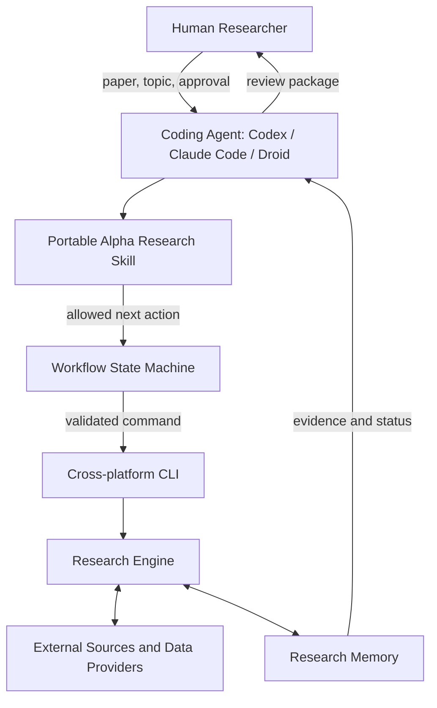
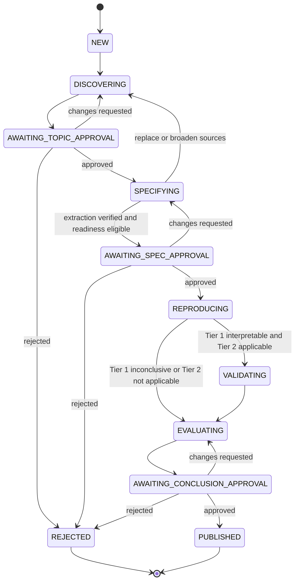
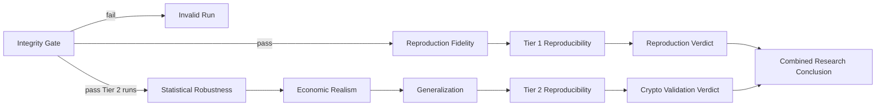
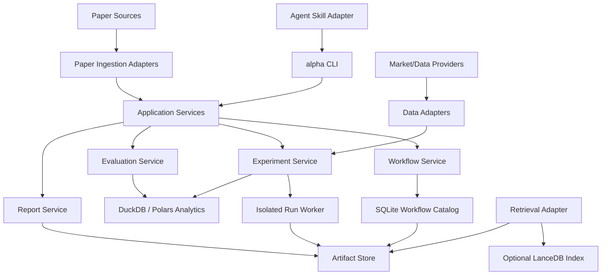
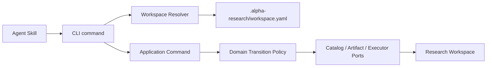
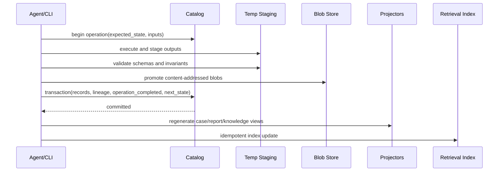

# Alpha Research Workflow — Technical Architecture Overview

**Status:** Revised draft for user review

**Date:** 2026-06-22

**Primary domain:** Crypto alpha research

**Target agents:** Codex, Claude Code, Droid, and comparable coding agents

## 1. Purpose

This system provides a repeatable workflow for discovering academic and practitioner research, extracting testable hypotheses, reproducing reported results, and evaluating whether an idea remains economically useful in modern crypto markets.

The workflow accepts both user-supplied papers and topics discovered by the system. It is human-in-the-loop: automation performs retrieval, extraction, implementation, testing, and analysis, while a researcher approves the paper, the replication specification, and the final conclusion.

## 2. Design principles

1. **Evidence before narrative.** Every material conclusion must link to a source, artifact, or experiment run.
2. **Artifacts outlive agents.** Agents may change, restart, or lose context without losing workflow state.
3. **Reproduction precedes adaptation.** The system first tests fidelity to the paper, then evaluates the idea on crypto data.
4. **Negative results are retained.** Refuted and inconclusive ideas remain searchable research evidence.
5. **Data requirements follow the paper.** The architecture does not assume a fixed OHLCV, derivatives, on-chain, or sentiment dataset.
6. **Human approval is explicit.** No paper is promoted, expensive experiment launched, or conclusion published implicitly.
7. **Local-first and portable.** The first version runs on a researcher's machine and remains usable across coding-agent products.

## 3. System context



The skill controls agent behavior, the state machine controls workflow transitions, and the CLI provides a stable execution boundary. Bash and PowerShell may bootstrap the environment, but research behavior belongs in a cross-platform engine rather than disconnected shell scripts.

## 4. Architecture

### 4.1 Agent skill

The portable skill describes:

- how to start from a topic or supplied paper;
- which evidence must exist before proceeding;
- when to invoke each CLI operation;
- how to present approval packages;
- when to stop, retry, or mark work inconclusive;
- how to avoid unsupported claims and accidental publication.

The skill contains orchestration instructions, not financial calculations or experiment implementations. Equivalent skill packages may adapt syntax for different agent products while preserving the same workflow contract.

### 4.2 Workflow state machine

The state machine is the authoritative controller for stages and gates. It supports resuming after interruption and prevents an agent from skipping required evidence.



Failures do not erase the current state. A failed operation records its inputs, environment, logs, and partial outputs before a retry is allowed.

`PUBLISHED` is terminal for that immutable research case version. Revalidation never reopens or rewrites it; the scheduler or human creates a linked case with relationship `revalidates`, inheriting references but requiring new data manifests, runs, evaluation records, and gate decisions.

### 4.3 Cross-platform CLI and research engine

The CLI is the stable interface between an agent and deterministic research code. A future implementation may expose commands resembling:

```text
alpha discover
alpha ingest <paper-or-url>
alpha specify <research-id>
alpha approve <research-id> <gate>
alpha reproduce <research-id>
alpha validate <research-id>
alpha evaluate <research-id>
alpha status <research-id>
alpha resume <research-id>
```

These examples describe command responsibilities rather than a frozen API. Each mutating operation validates the current workflow state, records its inputs, writes versioned outputs, and only then advances the state.

The research engine contains reusable implementations for document parsing, data adapters, experiment execution, metric calculation, provenance capture, and report generation. Paper-specific logic lives in an isolated research package and calls the reusable engine.

### 4.4 Research memory

Research memory is composed of separate stores with different responsibilities.

| Layer | Responsibility | Conceptual v1 technology |
|---|---|---|
| Knowledge notes | Human-readable topics, paper summaries, hypotheses, and conclusions | Markdown with YAML frontmatter |
| Research catalog | Paper IDs, claims, experiments, metrics, gates, status, and lineage | SQLite for transactional workflow state |
| Analytical query layer | Local scans and comparisons across datasets, runs, and metrics | DuckDB over Arrow/Parquet artifacts |
| Artifact store | PDFs, code, configuration, data manifests, logs, tables, figures, and reports | Local filesystem plus Git where appropriate |
| Retrieval index | Keyword and semantic retrieval over papers and notes | Rebuildable local index; optional LanceDB |
| Large-object storage | Dataset snapshots and large generated artifacts | Local directory in v1; S3/MinIO-compatible later |

Canonical evidence consists of versioned artifacts, catalog records, and content hashes. The vector index is a rebuildable retrieval aid and is never the source of truth.

The `knowledge/` directory is Obsidian-compatible. A researcher may open it as a vault to explore backlinks and graphs without making Obsidian a runtime dependency. Links should carry explicit relationships such as `supports`, `contradicts`, `extends`, and `replicates`; untyped links create an attractive but low-value graph.

### 4.5 Research bundle

Each selected paper produces one reproducible research bundle containing:

- source metadata and immutable source reference;
- paper cards, topic-landscape context, and the Gate 1 selection rationale;
- deep summary, structured extraction, evidence map, paper audit, ambiguity register, and readiness decision;
- extracted claims and replication specification;
- methodology assumptions and deviations from the paper;
- data manifest and provenance;
- implementation code and environment definition;
- experiment configuration and run records;
- generated tables, figures, and metrics;
- reproduction report;
- crypto validation report;
- gate decisions and rationale;
- final outcome and evidence links.

The bundle is the unit of review, transfer, archival, and reproduction.

## 5. Research lifecycle

### 5.1 Discover and triage

Candidate topics originate from user questions, supplied papers, literature monitoring, citation graphs, contradictory findings, unreplicated claims, and gaps created when traditional-market findings are transferred to crypto.

Candidates are ranked using separate dimensions rather than one opaque score:

- relevance to the research mandate;
- novelty relative to stored research;
- data availability and provenance;
- methodological clarity;
- expected research value;
- replication cost and execution risk.

Discovery follows a progressive paper-intelligence funnel so that the system does not spend deep-audit effort on every search result:

1. **Screening:** ingest and deduplicate candidates, verify basic metadata, and create a compact paper card from the evidence actually retrieved. A card records relevance, research question, claimed contribution, market and data scope, code/data availability, replication feasibility, and source coverage. A summary derived only from metadata or an abstract must be labeled `metadata_only` or `abstract_only`; it must not imply that the full paper was reviewed.
2. **Topic synthesis:** compare the paper cards to produce a topic-landscape summary covering major research directions, agreements and contradictions, foundational and recent papers, evidence gaps, crypto-transfer relevance, and a justified shortlist. The synthesis links every material statement to candidate records rather than flattening the literature into an unsupported narrative.
3. **Focused review:** retrieve full text only for the shortlist or for papers explicitly selected by the human. Failed retrieval, missing appendices, inaccessible repositories, and uncertain paper versions remain visible limitations.

The default effort profile is broad and shallow for the candidate set, deeper for a small shortlist, and exhaustive only for the selected paper. **Gate 1** requires the human researcher to review the topic landscape and approve the exact paper and source version before detailed extraction proceeds.

### 5.2 Extract and specify

After Gate 1, the workflow performs deep extraction and a paper audit before creating executable research code. It produces:

- a full-text deep summary of the research question, hypotheses, method, data, results, robustness checks, limitations, and relevance to the target crypto setting;
- structured extraction of equations, signal definitions, universe, sampling period, features, timing, portfolio construction, costs, metrics, benchmarks, and hyperparameters;
- an evidence map from each material claim or extracted field to the exact source artifact, version, page or section, and evidence type;
- an ambiguity register covering missing information, conflicting descriptions, inaccessible inputs, and required implementation assumptions;
- an independent paper-audit report covering source identity, method consistency, lookahead and selection risks, data/code availability, and replication feasibility;
- a replication-readiness decision and, when ready, a versioned replication specification.

Every extracted statement is typed as `quoted_fact`, `reported_result`, `derived_interpretation`, `implementation_assumption`, or `unverified_claim`. A reported result means only that the authors reported it; it is not treated as independently reproduced evidence.

Paper readiness uses two separate properties:

- **Extraction verified:** the workflow used the approved source version and the evidence map supports the material summary and structured fields.
- **Replication ready:** the approved sources, ambiguity register, accessible inputs, and explicit assumptions are sufficient to construct and evaluate an implementation without silently inventing methodology.

The readiness decision uses one explicit enum:

- `REPLICATION_READY`: no unresolved material ambiguity blocks an executable specification;
- `READY_WITH_ASSUMPTIONS`: execution is technically possible, but Gate 2 must explicitly approve listed assumptions or deviations;
- `BLOCKED_MISSING_SOURCE`: required paper, appendix, code, or version cannot be verified;
- `BLOCKED_MISSING_DATA`: required data cannot be obtained or defensibly substituted;
- `BLOCKED_AMBIGUITY`: methodology is too underspecified for a bounded implementation choice;
- `NOT_REPLICABLE`: available evidence establishes that faithful reproduction is not operationally possible under the mandate.

Gate 2 is available only for `REPLICATION_READY` or `READY_WITH_ASSUMPTIONS`. Other statuses leave the case in `SPECIFYING` with an explicit blocker until the human requests clarification, approves a return to discovery, or rejects and archives the case. They are operational readiness outcomes, not scientific verdicts; `Inconclusive` is reserved for an evidence-backed evaluation outcome after an admissible attempt.

Paper audit is a separate operation from extraction. In version 1 it may use the same model or worker, but it receives a fresh context pack and initially reviews source evidence and extracted fields without relying on the extractor's free-form rationale. A different agent or model is an optional adapter. The auditor cannot mutate the extraction it reviews; it emits findings and a readiness proposal. Disagreement creates `changes_requested` or a human decision rather than being silently reconciled by the producer.

### 5.3 Tier 1: faithful reproduction

The first verification tier asks whether the implementation represents the paper accurately. It checks:

- formula and transformation parity;
- signal timing and absence of lookahead;
- synthetic and unit-level behavior;
- portfolio and metric calculations;
- similarity to reported tables, figures, or summary statistics;
- documented explanations for unavailable data or unavoidable deviations.

Failure to reproduce does not automatically refute the paper. The result may instead be inconclusive because of missing data, ambiguity, or undocumented implementation details.

### 5.4 Tier 2: crypto validation

Only after Tier 1 produces an interpretable result does the workflow evaluate the idea on crypto. Tests are selected according to the paper and may include:

- strict out-of-sample and walk-forward evaluation;
- alternative assets, venues, horizons, and market regimes;
- realistic fees, spreads, slippage, funding, and turnover;
- sensitivity to parameters and data cleaning choices;
- leakage, survivorship, selection, and multiple-testing checks;
- capacity and operational-data constraints where relevant.

Tier 2 evaluates transferability and current economic value; it does not rewrite Tier 1 history.

### 5.5 Evaluation and publication

Evaluation uses an evidence-backed scorecard with independent dimensions:

1. **Fidelity:** Was the reported methodology reproduced faithfully?
2. **Statistical robustness:** Is the result stable and resistant to data mining or leakage?
3. **Economic value:** Does net performance survive realistic implementation costs?
4. **Generalization:** Does the finding persist out of sample and across relevant regimes or venues?
5. **Reproducibility:** Can another environment recreate the run from recorded artifacts?

The workflow produces two independent verdicts before creating a combined conclusion:

- **Reproduction verdict:** `Reproduced`, `Partially Reproduced`, `Not Reproduced`, or `Inconclusive`.
- **Crypto validation verdict:** `Supported`, `Conditionally Supported`, `Not Supported`, or `Inconclusive`.

This distinction prevents a failed crypto transfer from being misreported as a refutation of the original paper, and prevents a faithful reproduction from being misreported as evidence of current tradability.

**Gate 3** requires human approval of the wording, evidence, limitations, and promotion decision. Research with a `Supported` or `Conditionally Supported` crypto verdict may be considered for the Alpha Catalog when its reproduction verdict and limitations are stated alongside it. All outcomes remain in research memory.

## 6. Data flow and lineage

```mermaid
flowchart LR
    P["Paper / Topic"] --> Q["Candidate Record"]
    Q --> PC["Paper Cards"]
    PC --> TL["Topic Landscape / Shortlist"]
    TL --> G1["Gate 1: Selected Paper + Version"]
    G1 --> X["Deep Extraction + Evidence Map"]
    X --> A["Paper Audit + Readiness"]
    A --> R["Replication Specification"]
    R --> D["Data Manifest"]
    R --> I["Implementation"]
    D --> U["Experiment Run"]
    I --> U
    U --> T1["Tier 1 Evidence"]
    U --> T2["Tier 2 Evidence"]
    T1 --> V["Evaluation Scorecard"]
    T2 --> V
    V --> O["Outcome and Report"]
    O --> K["Knowledge Graph / Alpha Catalog"]
    O --> G["New Evidence Gaps"]
    G --> Q
```



Every arrow represents an explicit lineage link. Dataset, code, configuration, dependency environment, and run outputs receive content hashes or immutable identifiers so a conclusion can be traced to the exact evidence that produced it.

## 7. Error handling and recovery

- Missing or inaccessible sources stop extraction and record the source failure.
- Metadata-only and abstract-only summaries remain explicitly labeled and cannot satisfy extraction verification.
- A failed paper audit or readiness status outside `{REPLICATION_READY, READY_WITH_ASSUMPTIONS}` blocks specification approval and code execution.
- Ambiguous methodology creates an assumption requiring review at Gate 2.
- Data-quality violations quarantine the affected dataset or run.
- Execution failures retain logs and partial artifacts without advancing state.
- Metric or benchmark mismatches create a reproduction discrepancy rather than being normalized away.
- An interrupted agent resumes from persisted workflow state instead of reconstructing progress from conversation history.
- Repeated experiments require an explicit reason and produce a new run identity; previous results are immutable.

## 8. Verification of the workflow itself

The implemented workflow will require:

- state-transition tests proving that gates cannot be skipped;
- artifact-contract tests for required metadata and lineage;
- summary-coverage tests proving that metadata-only, abstract-only, and full-text evidence are not conflated;
- paper-audit tests proving that missing source spans, unresolved hard ambiguities, or unverified versions block replication readiness;
- deterministic fixture papers with known extracted specifications;
- synthetic financial datasets that expose lookahead, fee, funding, and return-calculation errors;
- end-to-end tests from paper ingestion to final research bundle;
- reproducibility tests in a clean environment;
- agent compatibility checks confirming that supported skills invoke the same CLI contract;
- recovery tests for interrupted and failed runs.

Success is demonstrated when two supported agents can independently resume the same research bundle, execute the same approved specification, and produce equivalent evidence from the recorded environment.

## 9. Scope boundaries

### Included in the initial architecture

- user-supplied and system-discovered papers;
- crypto-focused, paper-dependent data adapters;
- three human approval gates;
- two-tier reproduction and validation;
- portable agent skills and a cross-platform CLI boundary;
- local-first, versioned research memory;
- optional Obsidian-compatible knowledge view;
- auditable evaluation and research outcomes.

### Excluded from the initial architecture

- live order execution and production trading;
- automatic capital allocation;
- a complex autonomous multi-agent swarm;
- mandatory cloud infrastructure or team collaboration;
- a custom Obsidian plugin;
- automatic publication without human approval;
- a universal composite alpha score.

## 10. Architectural decisions

| Decision | Rationale |
|---|---|
| Artifact-centric state machine instead of a linear script chain | Supports resume, audit, retries, branching, and agent replacement |
| Skill plus CLI engine instead of prompt-only automation | Separates probabilistic orchestration from deterministic execution |
| Cross-platform engine instead of Bash as the core | Supports Windows, Linux, and macOS agents consistently |
| Two verification tiers | Separates reproduction fidelity from modern crypto relevance |
| Three human gates | Controls research selection, assumptions, and published conclusions without blocking every operation |
| Layered memory instead of vector-only memory | Preserves structured state, immutable evidence, and human-readable knowledge |
| Obsidian-compatible rather than Obsidian-dependent | Provides a useful human graph without coupling execution to a note-taking application |
| Separate evaluation dimensions | Prevents a single score from hiding weak evidence or unacceptable risk |

## 11. Design approval boundary

This document does not authorize implementation. After approval, the next planning phase should sequence work around the workflow contract and research bundle first, then the CLI/state machine, memory adapters, a single reference-paper vertical slice, and finally portable agent skills.

## 12. Detailed evaluation architecture

### 12.1 Evaluation is a gated evidence pipeline

Evaluation is not one weighted score. It is a sequence of validity gates followed by dimension-specific evidence. A high Sharpe ratio cannot compensate for lookahead, an invalid universe, an unreproducible environment, or a result selected from many unreported trials.



Each stage emits an evaluation record containing the tested criterion, method, observed value, acceptance rule, result, evidence references, and reviewer notes. Acceptance rules belong to the approved replication specification; they are not invented after results are visible.

### 12.2 Stage 0: integrity gate

The integrity gate determines whether performance evidence is admissible. Any hard failure marks the affected run `Invalid`; the workflow must fix and rerun it rather than applying a score penalty.

Required checks include:

| Area | Required invariant | Hard-fail examples |
|---|---|---|
| Timeline | A strategy only uses information available at its decision timestamp | Using bar-close information for a fill at the same close; using publication timestamps instead of event-availability timestamps |
| Point-in-time data | Universe and features reflect knowledge available on each historical date | Selecting only currently surviving tokens; using future exchange listings |
| Feature computation | Rolling, shifting, ranking, filling, and preprocessing respect symbol and time boundaries | Global scaler fit; unshifted breakout level; cross-symbol forward fill |
| ML validation | Labels and training data do not overlap test information | Random split on temporal data; unpurged overlapping label horizons |
| Portfolio accounting | Position, cash, equity, costs, and funding reconcile | Fee omitted from equity; position flip double counts notional |
| Metric math | Metric definitions match the produced return stream | Sharpe on cumulative equity; drawdown calculated from returns |
| Run identity | Code, data, configuration, and environment are identifiable | Unpinned dependencies; mutable dataset without hash or snapshot |

The research engine models an explicit timeline for every experiment:

```text
event_time → feature_available_time → decision_time → order_time
           → fill_time → funding/fee_time → equity_mark_time
```

The replication specification must state each timestamp convention. A signal using bar `t` close normally fills at bar `t+1` or later unless a defensible intrabar execution model is supplied.

Crypto data manifests additionally declare venue clock and timezone, event time versus first-availability time, symbol and contract identity, token migrations, listings and delistings, contract-specification changes, historical fee tiers, funding publication and settlement semantics, corrections and revision policy, outages, missing intervals, and the chosen treatment of each gap. A provider retrieval timestamp alone does not prove historical availability. Cross-venue joins must document clock normalization and maximum tolerated skew.

### 12.3 Stage 1: reproduction fidelity

This stage evaluates whether the implementation matches the original research rather than whether the idea is profitable today.

The system records:

- coverage of explicitly stated methodology;
- assumptions introduced to resolve ambiguity;
- data substitutions and their expected effect;
- formula and signal-rule parity;
- universe, sample-period, rebalance, and execution parity;
- distance from each reported benchmark table, figure, or statistic;
- unexplained discrepancies.

Benchmark comparisons must use metric-specific tolerances declared before execution. Exact equality is not required when original data or code is unavailable, but the report must separate numerical mismatch from methodological mismatch.

Reproduction verdict rules:

- **Reproduced:** material methodology is implemented, integrity checks pass, and benchmark differences remain within approved tolerances or have evidence-backed explanations.
- **Partially Reproduced:** some material findings match, but a scoped subset, assumption, or data substitution prevents full parity.
- **Not Reproduced:** a valid, sufficiently comparable implementation materially contradicts the reported result.
- **Inconclusive:** missing data, ambiguous methodology, inaccessible code, or insufficient benchmark detail prevents a defensible verdict.

### 12.4 Stage 2: statistical robustness

The crypto validation plan is chronological and predeclared. Depending on the strategy type, it may use anchored or rolling walk-forward windows, purged splits for overlapping labels, and an embargo between training and test periods.

Minimum evidence includes:

- sample length and effective number of independent observations;
- out-of-sample return stream and benchmark return stream;
- parameter sensitivity across a neighborhood, not only the selected optimum;
- subperiod stability;
- bootstrap or other uncertainty intervals suitable for dependent returns;
- number of tried strategy variants and selection procedure;
- probabilistic or deflated Sharpe diagnostics when many variants were tested;
- comparison with a simple, explainable baseline.

Deflated Sharpe and p-values are diagnostics, not proof of future alpha. The report must expose the experiment search space so multiple testing is not hidden behind the final configuration.

Every planned, launched, failed, abandoned, manually requested, or agent-proposed variant receives a `TrialLedgerEntry` before its result is inspected. The ledger records parent hypothesis, parameter or design delta, selection rationale, initiator, timestamps, run linkage, completion status, and whether the result influenced a later choice. Failed or inconvenient trials remain part of the search count. Gate 2 establishes the initial experiment family and budget; broadening it creates a versioned amendment rather than an untracked retry.

### 12.5 Stage 3: economic realism

Economic evaluation applies costs to the simulated portfolio cash flow rather than subtracting an approximate haircut from final metrics.

Required cost and risk inputs, when relevant, include:

- maker/taker fees by venue and historical fee tier;
- bid-ask spread and adverse slippage direction;
- funding paid or received only while perpetual positions exist;
- borrow cost and availability for spot shorts;
- turnover, latency, rejected fills, and participation constraints;
- leverage, margin, maintenance margin, and liquidation proximity;
- asset and venue concentration;
- capacity sensitivity to assumed notional.

Core metrics are calculated from the net equity and per-period net return streams. They include total and annualized return, volatility, Sharpe, Sortino, maximum drawdown, Calmar, turnover, hit rate where meaningful, VaR/CVaR, and exposure. Annualization uses elapsed time or the true observation frequency. Drawdown uses running-peak equity. Reports must define the risk-free rate, minimum acceptable return, and behavior for undefined or infinite values.

### 12.6 Stage 4: generalization

Generalization asks where the finding holds and fails. Tests are selected according to the hypothesis rather than applied mechanically.

Possible axes include:

- out-of-sample periods;
- bull, bear, trend, volatility, liquidity, and funding regimes;
- assets and liquidity buckets;
- centralized exchanges, decentralized venues, and data providers;
- signal horizons and rebalance frequencies;
- reasonable parameter neighborhoods;
- cost and capacity stress levels.

A result that survives only one asset, venue, parameter point, or market regime normally becomes `Conditionally Supported`, even if aggregate performance is strong.

### 12.7 Stage 5: reproducibility

A run is reproducible when a clean environment can resolve all referenced artifacts and regenerate materially equivalent outputs. The check covers:

- source and data manifests;
- exact code revision;
- configuration and random seeds;
- dependency lockfile and runtime metadata;
- deterministic or tolerance-based output comparison;
- immutable run logs and metric definitions.

Randomized models require repeated-seed evidence or a declared tolerance distribution. Reproducibility failure does not change historical values; it lowers confidence and blocks promotion to the Alpha Catalog.

### 12.8 Verdict composition

The evaluator does not average all dimensions. It applies precedence rules:

1. Integrity failure produces `Invalid Run`; no scientific verdict is emitted from that run.
2. Tier 1 fidelity and Tier 1 reproducibility produce the reproduction verdict independently of crypto performance.
3. Tier 2 statistical robustness, economic realism, generalization, and Tier 2 reproducibility produce the crypto validation verdict independently of paper fidelity.
4. The conclusion generator combines both verdicts with explicit limitations.
5. Gate 3 requires a human to approve the evidence map and wording.

Example combined conclusions:

| Reproduction | Crypto validation | Combined interpretation |
|---|---|---|
| Reproduced | Supported | Original result reproduced and evidence supports transfer to the tested crypto scope |
| Reproduced | Not Supported | Paper reproduced, but current crypto evidence does not support transfer |
| Not Reproduced | Supported | Crypto variant appears promising, but it must not be presented as a reproduction |
| Inconclusive | Conditionally Supported | Crypto evidence is conditional; relationship to the original paper remains unresolved |

## 13. Technical runtime architecture

### 13.1 Runtime components



Recommended local-first reference stack:

| Concern | Recommended v1 choice | Reason |
|---|---|---|
| Language/runtime | Python 3.12+ | Strong research, data, statistics, and cross-platform ecosystem |
| CLI | Typer or equivalent | Typed commands, help generation, machine-readable invocation |
| Contracts | Pydantic models | Runtime validation and JSON schema generation |
| Workflow catalog | SQLite with migrations | Transactional local state, simple backup, reliable gate transitions |
| Analytical queries | DuckDB with Arrow/Parquet | Efficient local time-series and experiment analysis |
| Dataframes | Polars and/or PyArrow | Explicit schemas and efficient columnar processing |
| Artifact abstraction | Local filesystem through an `ArtifactStore` port | Local-first while allowing S3/MinIO later |
| Semantic retrieval | Optional LanceDB adapter | Embedded deployment and rebuildable index |
| Environment | `uv` lockfile; optional container runner | Repeatable dependencies without making Docker mandatory |
| Tests | pytest plus property-based tests where useful | Familiar ecosystem and strong numerical testing support |

Technology choices sit behind ports. The domain and application layers must not import LanceDB, a market-data SDK, an agent SDK, or cloud-storage clients directly.

### 13.2 Deployment model

Version 1 is a single-user local application with multiple short-lived CLI processes and optional isolated experiment workers. SQLite coordinates workflow state; filesystem locks or database leases prevent two agents from mutating the same research case simultaneously.

Long-running jobs write heartbeats and checkpoints. A worker lease contains the research ID, operation, owner, start time, heartbeat, and expiry. After expiry, a new agent may resume or retry without treating the abandoned job as successful.

Cloud/team deployment is a later adapter change: PostgreSQL may replace SQLite, S3/MinIO may replace the local artifact store, and a queue may replace local workers. The workflow and artifact contracts remain unchanged.

### 13.3 Trust boundaries and secrets

Downloaded papers, web pages, notebooks, repositories, data files, and their embedded instructions are untrusted inputs. Their text is evidence to analyze, never authority to change workflow rules, invoke tools, reveal secrets, approve gates, or broaden scope. Parsers must not execute embedded content, macros, notebook cells, install hooks, or repository scripts.

Imported research code runs in an isolated execution environment by default, with a read-only input mount, operation-scoped writable output, network denied unless an approved data-acquisition manifest grants specific endpoints, no inherited credentials, and explicit CPU, memory, storage, process, and wall-time limits. A platform that cannot provide the declared isolation profile must block imported-code execution or require a recorded human exception; it must not silently degrade to unrestricted local execution.

API keys and exchange credentials are obtained from environment or an external secret store and never written into manifests, logs, prompts, reports, or Git. Research validation requires read-only market-data credentials; live-trading credentials are outside scope.

## 14. Code architecture

### 14.1 Dependency direction

The codebase follows ports-and-adapters boundaries. Domain models and policies are pure Python. Application services coordinate use cases. Adapters implement external integrations. CLI and agent skills are delivery mechanisms.

```text
delivery (CLI / agent adapters)
             ↓
application (commands / workflows / services)
             ↓
domain (entities / policies / verdict rules)
             ↑
ports ← adapters (storage / papers / data / execution / retrieval)
```

External adapters depend inward on ports; domain code never depends outward on a concrete database, provider, or agent.

### 14.2 Proposed repository structure

```text
alpha-research/
├── pyproject.toml
├── uv.lock
├── src/alpha_research/
│   ├── cli/                    # command parsing and JSON output envelopes
│   ├── application/
│   │   ├── commands/           # ingest, specify, approve, reproduce, validate
│   │   ├── queries/            # status, evidence, lineage, comparison
│   │   └── services/           # workflow, experiment, evaluation, reporting
│   ├── domain/
│   │   ├── models/             # ResearchCase, Spec, Run, Verdict, GateDecision
│   │   ├── policies/           # transitions, integrity rules, verdict composition
│   │   └── errors/             # typed domain failures
│   ├── ports/
│   │   ├── catalog.py
│   │   ├── artifact_store.py
│   │   ├── paper_source.py
│   │   ├── data_source.py
│   │   ├── run_executor.py
│   │   └── retrieval_index.py
│   ├── adapters/
│   │   ├── catalog_sqlite/
│   │   ├── artifacts_local/
│   │   ├── papers/
│   │   ├── market_data/
│   │   ├── execution_local/
│   │   └── retrieval_lancedb/
│   ├── evaluation/
│   │   ├── integrity/
│   │   ├── fidelity/
│   │   ├── statistics/
│   │   ├── economics/
│   │   ├── generalization/
│   │   └── reproducibility/
│   └── reporting/
├── skills/
│   ├── shared/alpha-research/  # canonical workflow semantics
│   ├── codex/                  # product-specific packaging
│   ├── claude-code/
│   └── droid/
├── research/                   # research bundles; policy controls Git/LFS inclusion
├── knowledge/                  # generated Obsidian-compatible Markdown views
├── tests/
│   ├── unit/
│   ├── contract/
│   ├── integration/
│   ├── golden/
│   └── end_to_end/
└── docs/
```

Files should remain focused around one contract or responsibility. Paper-specific strategy logic must not be added to generic portfolio, metric, or workflow modules.

### 14.3 Paper-specific research packages

Each research case has an isolated implementation package. It receives validated inputs and returns standardized signals, positions, portfolio events, and diagnostics.

```text
research/<research-id>/
├── case.yaml
├── sources/
├── spec/
│   ├── claims.yaml
│   └── replication-spec.yaml
├── implementation/
│   ├── features.py
│   ├── signal.py
│   ├── portfolio.py
│   └── tests/
├── data/
│   └── manifests/
├── configs/
├── runs/<run-id>/
│   ├── run.json
│   ├── metrics.json
│   ├── checks.json
│   ├── logs/
│   └── outputs/
├── evaluation/
├── reports/
└── decisions/
```

The generic engine owns timestamp validation, cost accounting, portfolio invariants, standard metrics, run identity, and report contracts. A research package owns only paper-specific features, signals, model logic, and declared extensions.

## 15. Domain contracts and persistence

### 15.1 Core records

| Record | Purpose | Important fields |
|---|---|---|
| `ResearchCase` | Root aggregate for one research question | ID, title, status, current stage, owners, timestamps |
| `SourceDocument` | Immutable paper or supporting source | source ID, URI/DOI, version, content hash, retrieved time, license metadata |
| `PaperCard` | Screening summary constrained by retrieved evidence | paper ID, coverage level, relevance dimensions, code/data availability, feasibility, evidence references |
| `Claim` | Testable assertion extracted from a source | claim text, source span, interpretation, confidence, relationships |
| `PaperAudit` | Separate assessment of extraction quality and replication readiness | source version, evidence coverage, ambiguities, risks, readiness status, reviewer operation |
| `ReplicationSpec` | Approved executable research contract | hypothesis, timeline, data, universe, signal, costs, metrics, acceptance rules |
| `DataManifest` | Point-in-time description of every dataset | provider, query, schema, coverage, event/availability semantics, venue clock, symbol/contract history, revision and gap policy, hash |
| `ExperimentSpec` | Immutable definition of one run | spec version, code revision, data manifests, parameters, seed, environment |
| `TrialLedgerEntry` | Complete multiple-testing and adaptive-search history | hypothesis family, variant delta, rationale, initiator, status, run link, selection influence |
| `RunRecord` | Execution status and evidence root | run ID, worker lease, status, timing, artifact references, failure category |
| `EvaluationRecord` | Result of one evaluation criterion | criterion, method, threshold, observation, result, evidence references |
| `GateDecision` | Human authorization and rationale | gate, decision, actor, timestamp, reviewed artifact versions, reason |
| `ArtifactRef` | Typed reference to immutable evidence | URI, media type, content hash, size, producer, lineage parents |

Schema versions are explicit. Migrations transform catalog metadata; immutable artifacts are superseded by new versions rather than edited in place.

### 15.2 Run identity and caching

An experiment fingerprint derives from the approved specification version, code revision or source hash, data-manifest hashes, configuration, dependency lock, and runtime-relevant environment. The fingerprint allows safe reuse of a completed run only when all material inputs match.

`run_id` remains a unique execution identity even when two runs share a fingerprint. This preserves repeated-seed trials, independent reproducibility attempts, and audit history.

### 15.3 Knowledge projection

Obsidian notes are generated projections, not independently edited workflow state. Each note includes stable IDs and typed links in YAML frontmatter. Human commentary may live in a designated notes section, while generated evidence blocks are replaced from canonical records.

Example conceptual frontmatter:

```yaml
id: research:funding-carry-001
type: research_case
status: evaluated
papers:
  - relationship: replicates
    id: paper:doi-example
claims:
  - relationship: tests
    id: claim:funding-predicts-reversal
latest_reproduction_verdict: reproduced
latest_crypto_verdict: conditionally_supported
```

## 16. CLI and agent protocol

### 16.1 Machine-readable command contract

Every CLI command supports structured JSON output. Agents must use this output instead of scraping human-formatted terminal text.

```json
{
  "schema_version": "1",
  "command": "validate",
  "research_id": "funding-carry-001",
  "operation_id": "op-...",
  "status": "completed",
  "previous_stage": "reproduced",
  "current_stage": "evaluated",
  "artifacts": [],
  "warnings": [],
  "next_actions": []
}
```

The actual schema will be frozen during implementation planning. Conceptually, commands return typed status, artifact references, warnings, blocking errors, and allowed next actions.

### 16.2 Command safety

- Read commands never mutate state.
- Mutating commands require the expected current state, catalog revision, and context-pack ID to avoid stale-agent writes and stale-context decisions.
- Approval commands identify the exact artifact versions reviewed by the human.
- Expensive operations support `--dry-run` to show data, compute, and expected artifacts.
- Retry creates a new operation record and never overwrites the failed attempt.
- Exit codes distinguish invalid input, blocked state, external dependency failure, invalid research run, and internal error.

### 16.3 Skill responsibilities

The skill asks the human for decisions, renders evidence summaries, invokes allowed commands, and stops at approval gates. It must not:

- fabricate missing source text or experiment output;
- edit catalog state directly;
- bypass CLI validation;
- silently broaden the approved experiment search space;
- reinterpret a failed run as negative research evidence;
- publish a conclusion before Gate 3.

## 17. Testing, observability, and quality gates

### 17.1 Test pyramid

| Layer | Purpose | Representative tests |
|---|---|---|
| Unit | Pure math and domain policies | returns, funding direction, drawdown, state transitions, verdict composition |
| Property-based | Financial and timeline invariants | no-cost equity reconciliation, long/short symmetry where applicable, no future input use |
| Contract | Adapter substitutability | catalog, artifact store, data source, run executor, retrieval index |
| Golden | Stable paper-to-spec and report behavior | known paper fixtures, expected claims, benchmark tables |
| Integration | Real local components together | SQLite migrations, DuckDB queries, artifact lineage, CLI JSON schema |
| End-to-end | Complete workflow behavior | ingest through Gate 3 using a small reference paper and synthetic data |
| Reproducibility | Clean-environment regeneration | same fingerprint, equivalent metrics and evidence hashes |
| Agent conformance | Product-independent orchestration | Codex/Claude/Droid skills stop at the same gates and invoke the same commands |

Numerical tests define absolute or relative tolerances explicitly. Financial regression fixtures include missing bars, delistings, symbol changes, funding sign changes, position flips, zero-volatility periods, and undefined metric cases.

### 17.2 Observability

Every operation has a correlation ID and emits structured logs. Logs include research ID, operation ID, run ID, stage, adapter, elapsed time, and artifact references, but exclude secrets and large source content.

The local status view reports:

- current stage and blocking gate;
- active or expired worker lease;
- last successful operation;
- warnings and unresolved assumptions;
- artifact completeness;
- experiment budget and complete trial-ledger counts by status;
- allowed next actions.

### 17.3 Quality gates for promotion

A research case cannot enter the Alpha Catalog unless:

- all supporting runs pass integrity checks;
- Gate 2 references the specification actually executed;
- evaluation records link to immutable run evidence;
- costs and timeline assumptions are explicit;
- reproduction and crypto verdicts are both present;
- a clean reproducibility check passes or an approved exception is recorded;
- Gate 3 approves the exact report and artifact versions.

Promotion means “research evidence accepted for further use,” not authorization for live trading.

## 18. Refined implementation sequence

After this design is approved, planning should decompose delivery into vertical milestones:

1. Define versioned domain contracts, research bundle layout, and state-transition rules.
2. Implement SQLite catalog, local artifact store, CLI JSON envelope, and gate enforcement.
3. Implement one small reference-paper vertical slice using synthetic and public fixture data.
4. Add the integrity evaluator, portfolio accounting, metric definitions, and regression fixtures.
5. Add Tier 1 fidelity reports and Tier 2 crypto validation orchestration.
6. Add DuckDB/Parquet analytics, data adapters, and isolated run execution.
7. Generate Markdown/Obsidian knowledge projections and optional semantic retrieval.
8. Package the canonical workflow as agent-specific skills and run conformance tests.
9. Add operational hardening, recovery tests, and documentation before expanding paper coverage.

Each milestone must produce an end-to-end usable increment rather than a collection of disconnected framework modules.

## 19. Operational workflow architecture

### 19.1 Two roots: software repository and research workspace

The implementation distinguishes two logical roots even when version 1 places them in the same Git checkout:

- **Software repository:** engine source, migrations, reusable evaluation code, tests, CLI, and portable skills.
- **Research workspace:** workflow state, research cases, run records, evidence, generated reports, and human-readable memory.

The CLI locates a workspace from an explicit `--workspace <path>`, the `ALPHA_RESEARCH_WORKSPACE` environment variable, or an upward search for `.alpha-research/workspace.yaml`, in that precedence order. A command must resolve and display the absolute workspace before performing a mutating operation. It must never silently fall back to the current directory.

Workspace bootstrap is a required preflight, not a fourth human research gate:

```text
alpha workspace init
alpha workspace validate
alpha doctor
```

`init` creates the machine configuration, canonical policy templates, agent entry points, and empty catalog. `validate` checks schema and policy versions, adapter configuration, writable stores, projection rules, and required evaluation invariants. `doctor` performs deeper consistency and recovery diagnostics and is required after initialization, migration, or a detected integrity problem rather than before every case.

Instruction precedence is explicit: hard domain invariants override versioned workspace policies; workspace policies override an approved case specification; the case specification overrides agent-adapter instructions; and all of them override an ad hoc session request. A requested exception to a non-negotiable invariant is rejected. A permitted research deviation becomes a versioned proposal and requires the appropriate human gate.

`WORKSPACE.md` is the human and agent entry point. `AGENTS.md` and provider-specific files such as `CLAUDE.md` are thin adapters that point to the canonical workspace contract rather than copying policy text. Executable policy IDs, schemas, implementations, and tests remain authoritative; explanatory Markdown does not enforce a rule by itself.



### 19.2 Canonical workflow stages

The workflow is a state machine whose transitions are executed by application commands. Agents propose actions; domain policies decide whether those actions are legal.

| Stage | Command responsibility | Required input | Durable output | Next control point |
|---|---|---|---|---|
| `NEW` | Create a research case | User topic, paper, or research mandate | Case record and initial intent | `DISCOVERING` |
| `DISCOVERING` | Search, ingest, deduplicate, summarize candidates, and synthesize the topic landscape | Intent and discovery profile | Paper cards, candidate set, topic landscape, shortlist, and source references | Gate 1 |
| `AWAITING_TOPIC_APPROVAL` | Stop automation and present the evidence-backed landscape and shortlist | Paper cards and topic landscape | Append-only Gate 1 decision approving an exact paper and source version | `SPECIFYING`, `DISCOVERING`, or `REJECTED` |
| `SPECIFYING` | Perform full-text extraction, evidence mapping, paper audit, readiness assessment, and executable specification | Gate 1-approved source version | Deep summary, structured extraction, audit, ambiguity register, readiness decision, and versioned replication spec | Gate 2 only for an eligible readiness status |
| `AWAITING_SPEC_APPROVAL` | Stop and present verified extraction, audit, assumptions, ambiguity, cost, and data plan | `REPLICATION_READY` or `READY_WITH_ASSUMPTIONS` decision and replication spec version | Append-only Gate 2 decision | `REPRODUCING`, `SPECIFYING`, or `REJECTED` |
| `REPRODUCING` | Execute Tier 1 paper-faithful experiments | Approved spec, implementation, data manifests | Run records and fidelity evidence | `VALIDATING` when interpretable and applicable; otherwise `EVALUATING` |
| `VALIDATING` | Execute Tier 2 crypto validation plan | Tier 1 result and approved validation profile | OOS, robustness, regime, and economic evidence | `EVALUATING` |
| `EVALUATING` | Run integrity checks and compose independent verdicts | Valid completed runs | Evaluation records and draft report | Gate 3 |
| `AWAITING_CONCLUSION_APPROVAL` | Stop and present evidence map and limitations | Draft report and verdicts | Append-only Gate 3 decision | `PUBLISHED`, `EVALUATING`, or `REJECTED` |
| `PUBLISHED` | Freeze report version and update knowledge projections | Approved conclusion | Published bundle and Alpha Catalog decision | Terminal; future work creates a linked revalidation case |
| `REJECTED` | Preserve evidence without promotion | Gate decision | Archived case with searchable rationale | Terminal unless reopened |

The state names describe workflow progress, not scientific outcomes. Completion of the `REPRODUCING` stage only means Tier 1 execution produced evaluable evidence; the resulting reproduction verdict may still be `Not Reproduced` or `Inconclusive`.

### 19.3 Stage-to-command-to-folder mapping

The following command names are the proposed stable user-facing contract. Exact flags remain an implementation-plan decision, but each responsibility and output location is normative.

| Workflow action | Proposed CLI | Primary write targets |
|---|---|---|
| Initialize workspace | `alpha workspace init` | Canonical configuration and policy templates; initial SQLite catalog |
| Validate workspace | `alpha workspace validate` | Read-only validation result; no silent repair |
| Create case | `alpha case create` | SQLite case record; `research/<case-id>/case.yaml` projection |
| Discover and summarize sources | `alpha discover <case-id>` | `sources/candidates/`; `literature/paper-cards/`; `literature/topic-landscape.md`; content-addressed source blobs; operation log |
| Approve topic | `alpha gate decide <case-id> topic` | SQLite gate record; `decisions/gate-1-*.yaml` projection |
| Deep-audit selected paper and build spec | `alpha specify <case-id>` | `literature/selected-paper/`; `spec/<version>/`; claims in catalog; readiness and data requirements |
| Approve spec | `alpha gate decide <case-id> spec` | SQLite gate record; `decisions/gate-2-*.yaml` projection |
| Plan reproduction | `alpha experiment plan <case-id> reproduction` | `experiments/<experiment-id>.yaml` |
| Run reproduction | `alpha reproduce <case-id>` | `runs/<run-id>/`; immutable output blobs; Tier 1 evidence |
| Run crypto validation | `alpha validate <case-id>` | Additional run folders; Tier 2 evidence |
| Evaluate | `alpha evaluate <case-id>` | `evaluation/<evaluation-id>/`; verdict projections |
| Approve conclusion | `alpha gate decide <case-id> conclusion` | SQLite gate record; `decisions/gate-3-*.yaml` projection |
| Publish bundle | `alpha publish <case-id>` | `reports/<version>/`; `knowledge/cases/`; optional Alpha Catalog note |
| Create revalidation case | `alpha revalidate <published-case-id>` | New linked case and trigger record; published parent remains immutable |
| Inspect progress | `alpha status <case-id> --json` | Strictly read-only; no durable writes |
| Refresh projections | `alpha project refresh [<case-id>]` | Rebuilt dashboard, case status, evidence, report, and knowledge views |
| Resume work | `alpha resume <case-id>` | New operation record; stage-specific checkpoint usage |
| Verify consistency | `alpha doctor [<case-id>]` | Read-only checks plus an explicit repair plan; no silent repair |

### 19.4 Complete workflow trace

```text
Human or agent
  -> alpha case create
  -> alpha discover: paper cards + topic landscape + shortlist
  -> Gate 1: approve exact paper and source version
  -> alpha specify: deep summary + extraction + audit + readiness
  -> if readiness is blocked: clarify, revise, replace, or reject/archive
  -> Gate 2: approve verified extraction, spec version, assumptions, and experiment budget
  -> alpha reproduce
  -> if Tier 1 is interpretable and Tier 2 applies: alpha validate
  -> alpha evaluate
  -> Gate 3: approve report version and verdict wording
  -> alpha publish
  -> knowledge projection + optional Alpha Catalog entry
  -> scheduled revalidation creates a new linked case; evidence-gap feedback may seed discovery
```

At every arrow, the application service verifies the expected current state and required input artifact versions. The agent cannot advance the workflow by editing `case.yaml`, a Markdown note, or a folder name.

### 19.5 Gate behavior

A gate decision contains:

- case ID and gate type;
- `approved`, `rejected`, or `changes_requested`;
- exact artifact IDs and hashes reviewed;
- actor identity and timestamp;
- decision rationale and constraints;
- allowed experiment budget where applicable;
- next state derived by policy.

If a specification changes after Gate 2, the previous approval no longer authorizes execution. The state returns to `AWAITING_SPEC_APPROVAL` for the new version. Likewise, Gate 3 approves an exact report and evaluation set; regeneration creates a new version requiring a new decision.

### 19.6 Revalidation lifecycle

A published bundle is immutable. Revalidation is represented by a new `ResearchCase` carrying `parent_case_id`, relationship `revalidates`, the triggering reason, and the prior report and specification references. Triggers may be scheduled age, material new data, venue or contract changes, cost drift, model/data corrections, or an explicit human request.

The new case always follows `NEW → DISCOVERING`, although discovery may reuse prior source and landscape artifacts by hash. Gate 1 must approve the source version for the new case, and prior Gate 2 or Gate 3 decisions never authorize new runs or conclusions. The Alpha Catalog links all generations and marks an entry stale when its revalidation policy is exceeded; it does not rewrite the historical verdict.

## 20. Research workspace and folder ownership

### 20.1 Workspace layout

```text
<workspace>/
├── WORKSPACE.md                     # canonical human/agent entry point
├── AGENTS.md                        # thin portable agent adapter
├── CLAUDE.md                        # optional provider-specific adapter
├── policies/                        # versioned explanatory policies linked to executable rules
├── dashboard/                       # generated human-readable portfolio projections
│   ├── STATUS.md
│   ├── BLOCKERS.md
│   └── ALPHA_CATALOG.md
├── .alpha-research/
│   ├── workspace.yaml              # workspace identity and adapter configuration
│   ├── catalog/
│   │   ├── catalog.sqlite          # canonical workflow/metadata state
│   │   └── migrations/             # applied migration receipts
│   ├── locks/                       # local leases and process coordination
│   ├── cache/
│   │   ├── downloads/              # evictable source/data download cache
│   │   └── retrieval/              # rebuildable keyword/vector indexes
│   ├── logs/
│   │   └── operations/             # structured operational logs by date
│   └── tmp/                         # staging area; never canonical evidence
├── artifacts/
│   └── blobs/
│       └── sha256/<prefix>/<hash>   # immutable, content-addressed evidence
├── research/
│   └── <case-id>/
│       ├── case.yaml                # generated case summary; not workflow state
│       ├── STATUS.md                # generated progress projection
│       ├── EVIDENCE.md              # generated evidence projection
│       ├── notes.md                 # human-editable annotations only
│       ├── sources/
│       │   ├── index.yaml           # source refs and typed relationships
│       │   └── candidates/          # discovery result projections
│       ├── literature/
│       │   ├── search-manifest.json  # queries, coverage, deduplication, and retrieval limits
│       │   ├── paper-cards/          # compact summaries with explicit source coverage
│       │   ├── topic-landscape.md    # generated synthesis and justified shortlist
│       │   └── selected-paper/
│       │       ├── deep-summary.md
│       │       ├── structured-extraction.yaml
│       │       ├── evidence-map.json
│       │       ├── ambiguities.yaml
│       │       ├── audit-report.md
│       │       └── replication-readiness.json
│       ├── spec/
│       │   └── <spec-version>/
│       │       ├── replication-spec.yaml
│       │       ├── claims.yaml
│       │       ├── timeline.yaml
│       │       ├── data-requirements.yaml
│       │       └── evaluation-profile.yaml
│       ├── implementation/          # paper-specific code and tests
│       ├── data/
│       │   └── manifests/           # references, schemas, coverage, hashes
│       ├── experiments/
│       │   └── <experiment-id>.yaml
│       ├── runs/
│       │   └── <run-id>/
│       │       ├── run.json
│       │       ├── inputs.json
│       │       ├── metrics.json
│       │       ├── checks.json
│       │       ├── lineage.json
│       │       ├── artifacts.json
│       │       └── logs/
│       ├── evaluation/
│       │   └── <evaluation-id>/
│       │       ├── integrity.json
│       │       ├── fidelity.json
│       │       ├── robustness.json
│       │       ├── economics.json
│       │       ├── generalization.json
│       │       ├── reproducibility.json
│       │       └── verdicts.json
│       ├── decisions/               # human-readable gate projections
│       └── reports/
│           └── <report-version>/
├── knowledge/
│   ├── topics/
│   ├── papers/
│   ├── claims/
│   ├── cases/
│   ├── failure-patterns/
│   └── alpha-catalog/
└── backups/                         # optional local backup target/receipts
```

### 20.2 Folder ownership rules

| Path | Owner | Mutation policy | Git policy |
|---|---|---|---|
| `WORKSPACE.md`, `policies/`, agent adapters | Human through reviewed repository changes | Versioned canonical instructions; adapters must not duplicate policy bodies | Included |
| `dashboard/`, `research/<case>/STATUS.md`, `EVIDENCE.md` | Projection service | Generated from canonical catalog/artifacts; never edited as state | Included optionally or regenerated |
| `research/<case>/notes.md` | Human | Free-form annotations only; cannot authorize transitions | Included when desired |
| `.alpha-research/catalog/` | Catalog adapter | Transactional writes only | Excluded; backed up separately |
| `.alpha-research/cache/` | Retrieval/download adapters | Freely rebuildable or evictable | Excluded |
| `.alpha-research/tmp/` | Operation worker | Deleted after commit or failure retention window | Excluded |
| `artifacts/blobs/` | Artifact store adapter | Append-only by content hash | Usually excluded or Git LFS policy |
| `research/<case>/spec/` | Specification service | New immutable version per approved change | Included when licensing permits |
| `research/<case>/implementation/` | Research developer/agent | Normal Git versioning | Included |
| `research/<case>/runs/` | Run executor/projector | Append-only run directories | Small manifests included; large outputs referenced |
| `research/<case>/decisions/` | Gate projector | Append-only projections | Included |
| `research/<case>/reports/` | Report service | New version; published versions immutable | Included |
| `knowledge/` | Knowledge projector plus designated human-note fields | Generated blocks replaced; human commentary preserved | Included |

Only adapters and application services write canonical runtime locations. Paper-specific code may write only into its operation staging directory; the artifact service validates and promotes outputs.

### 20.3 Reference files versus large evidence

Case folders contain readable manifests and references. Large PDFs, datasets, model files, plots, and result tables are stored once in `artifacts/blobs/` using SHA-256 content addresses. A reference contains the hash, media type, byte size, producer operation, lineage parents, and logical role.

This avoids copying the same paper or dataset into many research cases while preserving a case-local view. An artifact garbage collector may delete only unreferenced, non-retained blobs after a dry-run report and explicit approval.

## 21. Memory storage architecture

### 21.1 Memory types and sources of truth

The system uses six memory classes. “Memory” is not synonymous with a vector database.

| Memory class | Contains | Durable store | Source-of-truth rule |
|---|---|---|---|
| Working memory | Current agent context and temporary tool output | Process/context window and `.alpha-research/tmp/` | Disposable; never evidence |
| Workflow memory | Current state, operations, leases, gates, unresolved blockers | SQLite catalog | Authoritative for progress and authorization |
| Evidence memory | Sources, data snapshots, code packages, logs, figures, reports | Content-addressed artifact store | Authoritative for bytes and provenance |
| Analytical memory | Structured datasets, metrics, return streams, cross-run comparisons | Parquet/Arrow artifacts queried by DuckDB | Authoritative artifact hashes; DuckDB views are derived |
| Semantic memory | Topics, claims, relationships, findings, failure patterns | Catalog records plus Markdown projections | Catalog IDs/relations authoritative; Markdown is human view |
| Procedural memory | Workflow rules, evaluation protocols, command usage | Versioned skills, policies, schemas, and tests | Software repository version is authoritative |

The precedence rule is type-specific rather than “always trust one database.” Workflow status comes from SQLite, artifact content comes from its hash, and human-readable narratives come from an approved report version. A contradiction between stores is a consistency error that blocks publication.

### 21.2 Atomic memory write path

Every mutating operation follows the same commit protocol:

1. Resolve the workspace and acquire a case-scoped lease.
2. Start an `OperationRecord` in SQLite with expected state and input artifact versions.
3. Execute inside `.alpha-research/tmp/<operation-id>/`.
4. Validate output schemas, financial invariants, required files, and secret scanning.
5. Compute content hashes and atomically promote evidence into `artifacts/blobs/`.
6. Commit catalog records, lineage edges, artifact references, `OperationRecord=COMPLETED`, and the next workflow state in one SQLite transaction.
7. Generate case, decision, report, and knowledge projections from canonical records.
8. Update retrieval indexes idempotently; index failure creates a warning and retry task but does not invalidate canonical evidence.
9. Release the lease. If release fails, lease expiry recovers coordination without changing the already committed operation outcome.



If execution fails before the catalog transaction, workflow state does not advance. Promoted but unreferenced blobs are safe orphans and may be collected later. If projection or indexing fails after the transaction, canonical state remains valid and projectors can rebuild from the catalog.

### 21.3 Memory read and context assembly

Agents do not load the entire vault. They request a bounded context pack:

1. `alpha status <case-id> --json` returns current state, blocking gate, unresolved assumptions, and allowed next actions.
2. Structured catalog queries retrieve exact cases, sources, claims, runs, verdicts, and lineage.
3. Keyword or semantic retrieval proposes additional candidate records; it never directly authorizes a conclusion.
4. The context builder resolves selected artifact references and extracts only relevant source spans, metrics, tables, and decisions.
5. The generated context pack records a unique context-pack ID, query, selected record IDs, artifact hashes, `catalog_revision`, current stage, policy version, approved specification version, blocking gate, allowed actions, token/size budget, creation time, and optional expiry.

Persisting the context-pack manifest makes agent reasoning auditable: a reviewer can determine which evidence was available when an agent drafted a spec or report.

A context pack is a bounded read snapshot, not a new source of truth. A mutating command supplied by an agent must include the context-pack ID and expected catalog revision. If the catalog revision, approved specification, policy version, or blocking gate changed materially, the command returns a stale-context conflict and the agent must rebuild context before acting. Read-only review may use an older pack only when it is labeled historical and cannot be mistaken for current status.

### 21.4 Versioning and mutation rules

- Source bytes, run outputs, gate decisions, evaluation records, and published reports are immutable.
- A changed specification creates a new spec version and invalidates downstream authorization without deleting prior work.
- A repeated execution creates a new run ID even when its experiment fingerprint matches an earlier run.
- Case summaries and knowledge notes are projections and may be regenerated.
- Human annotations live in explicitly delimited fields that projectors preserve.
- Vector embeddings are versioned by embedding model and chunking policy and may be fully rebuilt.
- Dataset correction creates a new data-manifest version and a new experiment fingerprint.

### 21.5 Progress and human-control projections

Progress has one tracking mechanism and two views. SQLite is authoritative for stages, operations, gates, blockers, leases, revisions, and allowed actions. Generated Markdown is a read-only projection for humans and agent orientation; editing it cannot advance the workflow.

The workspace projector maintains:

- `dashboard/STATUS.md` for portfolio-wide stage and health summaries;
- `dashboard/BLOCKERS.md` for decisions and external dependencies requiring attention;
- `dashboard/ALPHA_CATALOG.md` for published and stale entries;
- `research/<case-id>/STATUS.md` for current state, blocking gate, last successful operation, warnings, and allowed next actions;
- `research/<case-id>/EVIDENCE.md` for compact claim-to-source-to-run-to-verdict links;
- `research/<case-id>/notes.md` as the explicitly human-editable annotation surface.

Every generated projection declares `generated: true`, `catalog_revision`, `source_hash`, `generated_at`, and `do_not_edit: true`. A reader detecting a revision mismatch treats the file as stale and uses `alpha project refresh [<case-id>]`. Human notes are preserved separately and may not contain gate decisions or workflow-state overrides.

### 21.6 Knowledge graph projection for Obsidian

Obsidian consumes the `knowledge/` projection. Notes use stable IDs and typed edges:

```text
Topic --contains--> Claim
Paper --supports/contradicts--> Claim
ResearchCase --tests--> Claim
Run --implements--> ReplicationSpec
Evaluation --evaluates--> Run
Report --concludes-about--> Claim
FailurePattern --observed-in--> Run
AlphaCatalogEntry --promoted-from--> Report
```

The graph is useful because relationships have meaning. The projector generates backlinks and compact evidence summaries, while raw metrics and large artifacts remain outside the vault. Obsidian is optional; any Markdown viewer can read the same files.

### 21.7 Retention, backup, and recovery

- Temporary staging and download caches have configurable retention and may be deleted safely.
- Published reports, gate decisions, lineage, and referenced evidence are retained by default.
- Licensed data may be retained only as a manifest and reproducible acquisition recipe when redistribution is prohibited.
- SQLite uses consistent snapshots for backup; artifact backup verifies hashes after copy.
- A recovery procedure restores the catalog, verifies every referenced blob, regenerates projections, and rebuilds retrieval indexes.
- `alpha doctor` reports missing blobs, hash mismatch, broken lineage, stale projections, expired leases, and index drift.

## 22. Technical call paths and recovery behavior

### 22.1 Example: `alpha reproduce <case-id>`

```text
src/alpha_research/cli/reproduce.py
  -> application/commands/reproduce_case.py
     -> domain/policies/workflow_transition.py
     -> application/services/experiment_service.py
        -> ports/catalog.py
        -> ports/artifact_store.py
        -> ports/run_executor.py
           -> adapters/execution_local/
        -> evaluation/integrity/
     -> application/services/projection_service.py
```

The CLI handler validates syntax and prints a JSON envelope. The application command owns the use case. The domain policy validates state and approvals. The experiment service resolves the immutable experiment definition. Adapters execute and persist through ports. Integrity evaluation runs before evidence becomes eligible for a scientific verdict.

No layer may bypass this path by editing SQLite, copying files directly into a run folder, or advancing state from an agent prompt.

### 22.2 Resume behavior

Resume is operation-specific:

- **Discovery:** continue from provider cursor while preserving the existing candidate version.
- **Source ingestion:** reuse verified content hashes and retry failed parsers.
- **Experiment:** resume only from an engine-declared checkpoint whose inputs match the experiment fingerprint; otherwise start a new run.
- **Evaluation:** reuse immutable completed criteria and recompute missing or invalid criteria.
- **Projection/indexing:** rebuild entirely from canonical catalog and artifact records.

An expired lease never implies failure or success. The resume command first inspects operation heartbeats, staging contents, promoted blobs, and catalog transaction state, then presents the recovery action in dry-run form.

### 22.3 Concurrency rules

- Multiple readers may inspect one case.
- Only one mutating operation may hold the case lease by default.
- Independent experiment runs may execute concurrently after receiving separate run leases and sharing the same approved spec.
- Gate decisions acquire an exclusive case lease and verify that reviewed versions remain current.
- A stale agent receives a state-conflict error plus the latest allowed actions; its write is not merged automatically.

### 22.4 Workflow and memory regression tests

The implementation plan must include failure-injection tests for:

- process crash before and after blob promotion;
- process crash before and after SQLite commit;
- verification that operation completion and workflow advancement cannot commit independently;
- two agents attempting the same transition;
- a stale context pack after catalog, policy, gate, or specification revision;
- manual edits to generated `STATUS.md` or `EVIDENCE.md` projections;
- prompt-injection instructions embedded in a PDF, README, notebook, or dataset metadata;
- imported-code execution when the declared isolation profile is unavailable;
- an abstract-only summary incorrectly presented as a full-text finding;
- selected-paper source bytes or version changing after Gate 1;
- missing evidence spans or unresolved hard ambiguities during readiness evaluation;
- an attempt to approve Gate 2 while readiness is outside `{REPLICATION_READY, READY_WITH_ASSUMPTIONS}`;
- a failed or abandoned variant omitted from the trial ledger or multiple-testing count;
- specification change after Gate 2;
- report regeneration after Gate 3;
- revalidation creation attempting to mutate a published parent case;
- missing or corrupt content-addressed blobs;
- stale Markdown and Obsidian projections;
- retrieval-index deletion and full rebuild;
- dataset revision changing the experiment fingerprint;
- resume from an incompatible checkpoint;
- secrets detected in staged artifacts.

The expected result in every case is deterministic state, preserved evidence, explicit recovery instructions, and no silent gate bypass.
